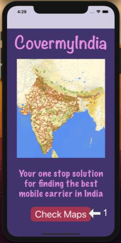
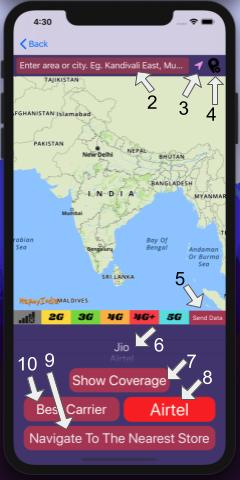

# CovermyIndia 

Made by Ishan Sharma, Powered by  
  Your one stop solution for finding the best mobile carrier in India.

## User Interface Buttons
 

1. **Check Maps** - To go to main page containing maps.
2. **Text Field** - To enter any place/area/city etc with suggestions in table view below.
3. **User Location** - To go user's current location.
4. **Delete Marker** - Delete the already placed custom marker on the map.
5. **Send Data** - To send user's current data safely to our secure servers.
6. **Carrier Picker** - To choose the carrier for displaying coverage map.
7. **Show Coverage** - To plot the coverage map for the selected carrier from Carrier Picker(6).
8. **Best Carrier Display** - Label To display the best carrier in the user's locality/any custom location.
9. **Nagivate to Store** - To help user navigate to the nearest best carrier store from his/her current location.
10. **Best Carrier** - To get the best carrier for user's locality/any custom location and display it inside Best Carrier Display(8).

## Requirments

#### iOS: 12.0+
#### Swift: 5+
#### XCode: Version 11.0+
#### Storyboard: iPhone 11 Pro Max only
#### Simulator: iPhone 11 Pro Max only

### CocoaPods Dependencies

- MapymyIndiaMaps
- MapmyIndiaDirections
- FirebaseCore
- FirebaseFirestore

## Build and Run Instructions

- Step 1: Download this project folder or clone this repository.

- Step 2: Open the project using the file `CovermyIndia.xcworkspace` only.

- Step 3: Please make sure that you have set the devices for storyboard and simulator appropriately as mentioned above.

- Step 4: Go to `Product -> Build` OR `Press ⌘ B` to build the project. It may take a few minutes with 1000+ tasks.

- If the build fails due to few functions/structs/classes unidentifiable do the following steps or else continue to Step 5

  - Step 4.1: Close and quit XCode completely.
  - Step 4.2: Open terminal and change directory to the main project folder `CovermyIndia`.
  - Step 4.3: If Cocoa Pods is not isntalled on your system [refer this](https://wiki.base22.com/btg/how-to-setup-cocoapods-65373274.html) else continue.
  - Step 4.4: Run `pod install` and wait for the terminal processes to finish executing.
  - Step 4.5: After finishing, open the project using the file `CovermyIndia.xcworkspace` only and continue steps 2-4.
 

- Step 5: If you are using a simulator, please set a custom location by going to `Features -> Location -> Custom Location` inside the simulator title bar or [refer here](https://medium.com/@merlos/how-to-simulate-locations-in-xcode-b0f7f16e126d)

- Step 6: Once build successfully, and location set in simulator you can now run the app using `Press ⌘ R` or `Product -> Run`.

## Contact

Changes/suggestions are welcome at `sharmaishan747@gmail.com` or `f2016773@pilani.bits-pilani.ac.in`